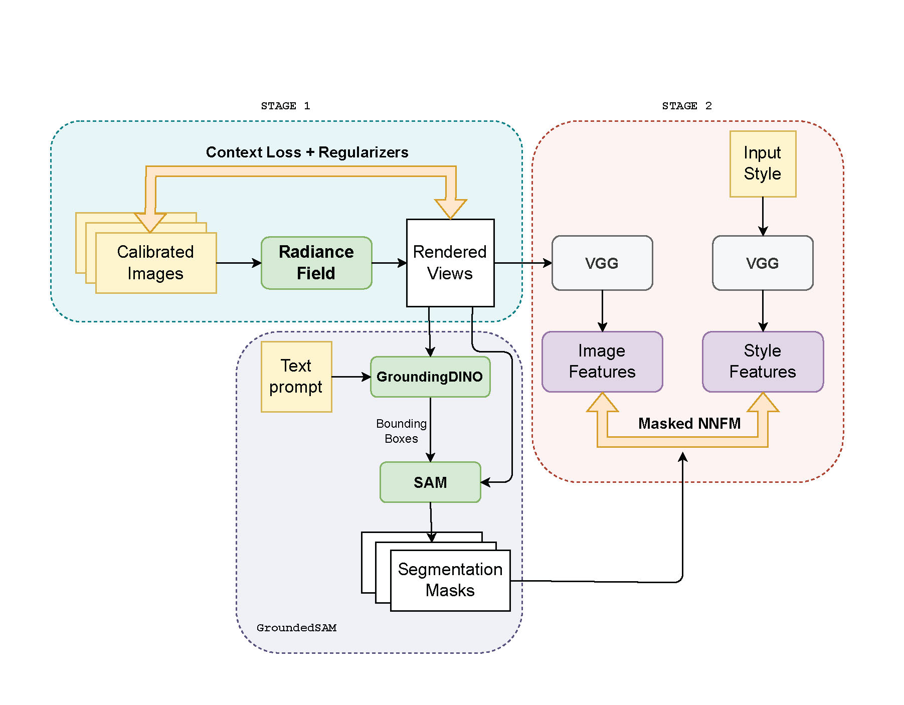

# Language-Guided-3D-Stylization

A language-guided 3D stylization method combined with ARF and GroundedSAM.

This work mainly builds upon [GroundedSAM](https://github.com/IDEA-Research/Grounded-Segment-Anything) and [ARF](https://github.com/Kai-46/ARF-svox2). Please refer to their original repositories for more details.

## Quick start
Install the GroundedSAM environment by following the instructions in [GroundedSAM](https://github.com/IDEA-Research/Grounded-Segment-Anything). You could also refer to groundedsam/text_segment_data_convert.ipynb to test the GroundedSAM.

```shell
cd ARF_svox2_groundedsam
```

Then install the ARF environment by following ARF_svox2_groundedsam/install.sh or the original [ARF repo](https://github.com/Kai-46/ARF-svox2), and prepare the data (ARF_svox2_groundedsam/download_data.sh).

Run the following command to generate the stylized 3D scene:

```shell
cd ARF_svox2_groundedsam/opt
bash try_llff_groundedsam.sh
```

You could directly change the text prompt, style image, and scene name in the script.



Given a text prompt `tv`, a style image (Starry Night), and views by pre-trained radiance field, our method generates a stylized 3D scene. See some of our results in `/results`. You could also find more results in our [Gdrive](https://drive.google.com/drive/folders/1MGDzuIBM8fDFUu4aejPmWO8yo4kwiwLg?usp=sharing).